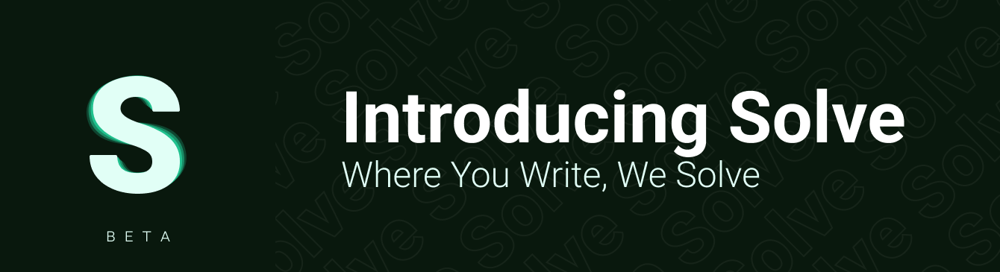
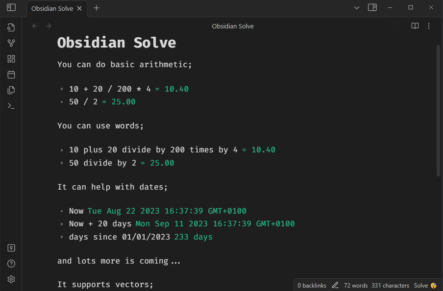

  

## Obsidian Solve

An unobtrusive Obsidian plugin that quietly processes equations and patterns in real time, inspired by [NoteMaster's Smart Mode](https://github.com/LiamRiddell/NoteMaster#introducing-smart-mode). With solid engineering at its core, Solve enhances note-taking without relying on ChatGPT. For instance, effortlessly calculates date expressions (e.g., 'Now + 20 days'), performs arithmetic (e.g., '10 + 5'), and more features are coming soon.

### Arithmetic Brilliance 💡

Unveil the magic of arithmetic with Solve, where simplicity meets precision. Brace yourself for seamless calculations that redefine your note-taking.

| You Express        | Solve Delivers |
| ------------------ | -------------- |
| 10 + 20 / 200 \* 4 | 10.40          |
| 50 / 2             | 25.00          |
| 50 divide by 2     | 25.00          |

### Dynamic Date Mastery 📅

Step into the realm of dates with Solve, where time manipulation is at your fingertips. Experience dates like never before.

| You Express           | Solve Delivers                    |
| --------------------- | --------------------------------- |
| days since 01/01/2023 | 233 days                          |
| 01/01/2023 + 20 days  | Sat Jan 21 2023 00:00:00 GMT+0000 |
| 01/01/2023 - 2 months | Tue Nov 01 2022 00:00:00 GMT+0000 |

But wait, there's more! Visit [our documentation](https://github.com/LiamRiddell/obsidian-solve/wiki) for an extensive list of patterns that Solve can seamlessly recognize. It's time to embrace the future of note-taking precision. 📚✨

## Embark on a Feature-Rich Journey 🚀🌟

Our feature list is a testament to the dynamic capabilities we offer to enhance your note-taking experience. Let's take a glimpse into what awaits:

-   [**Arithmetic Enrichment:**](https://github.com/LiamRiddell/obsidian-solve/wiki/Basic) Navigate through the realms of basic arithmetic, explore intricate mathematical functions, and traverse the vectors' landscape. An upcoming addition to this family is the captivating realm of Hex arithmetic.

-   [**Datetime Delve:**](https://github.com/LiamRiddell/obsidian-solve/wiki/Datetime) Dive into the world of time manipulation with our Datetime feature, currently in its alpha stage. Explore this exciting capability and stay tuned for its evolution.

-   [**Percentage Proficiency:**](https://github.com/LiamRiddell/obsidian-solve/wiki/Percentage) Embark on a journey through the numeric nuances of percentages with the adept integration of Obsidian Solve's Percentage Provider. Delve into a symphony of quantitative relationships, from discerning parts of a whole to understanding increases and decreases. This feature elevates your note-taking to an analytical art form, rendering complex percentage calculations as simple as jotting down a thought.

-   [**Units of Measurement:**](https://github.com/LiamRiddell/obsidian-solve/wiki/Units-Of-Measurement) Diversify your numerical toolkit with the newly introduced ability to interpret and convert a multitude of measurement units. Obsidian Solve now speaks the language of distance, volume, weight, and more, bringing a newfound depth to your data interaction.

-   **Community Collaboration:** Engage in collaborative innovation with our Community Provider Support. Join forces with fellow creators to extend Solve's potential.

-   **Aesthetic Harmony:** Immerse yourself in the harmony of aesthetics with theming support through the Obsidian [Style Settings Plugin](https://github.com/mgmeyers/obsidian-style-settings/) by [@mgmeyers](https://github.com/mgmeyers). Your notes, your style.

Obsidian Solve is a canvas of endless possibilities. As we continue to evolve, we eagerly await your requests to shape the future functionalities of this powerful plugin. Come, explore, and shape the future with us! 🌟🔮

## Effortless Installation Magic ✨

Embarking on your Obsidian Solve journey is as enchanting as it is rewarding. Get ready to experience installation in a whole new light.

### Automated Elegance

Why settle for the mundane when you can bask in automated brilliance? Our **recommended** approach to installation is a seamless experience you won't want to miss:

-   Head to the community plugins browser within Obsidian.
-   Search for "Obsidian Solve."
-   Click "Install." Feel the thrill as your journey unfolds effortlessly.

### Manual Marvel

For those who relish a touch of manual marvel, we've got you covered:

-   Delve into your plugin adventure by copying over `main.js`, `styles.css`, and `manifest.json` to your vault. Find your vault at `VaultFolder/.obsidian/plugins/your-plugin-id/`.
-   Revel in the satisfaction of crafting your journey step by step.

Choose your path, embark on your voyage, and embrace the enchantment that is Obsidian Solve! 🪄📜

## Gratitude Galore 🙌

A colossal shoutout to the forces that fuel our innovation! We extend our heartfelt appreciation to the brilliance behind:

-   [Ohm-js](https://ohmjs.org/): The backbone of our precision, powering the magic of parsing and calculations. Your genius propels us forward.
-   [Obsidian MD](https://obsidian.md/): The nurturing ground that breathes life into our vision, elevating it to new heights.
-   [convert-units](https://github.com/convert-units/convert-units): The virtuoso of versatility, infusing Obsidian Solve with the mastery to effortlessly translate and transform units.

Join us in raising a virtual toast to these pillars of progress! 🥂🌟

## Embrace the Legacy 🌟

As we bid farewell, a tale of revival and innovation lingers in the air. Obsidian Solve emerged from the ashes of a fading concept known as NoteMaster Smart Mode, rekindled by the remarkable canvas that is Obsidian. A fusion of past and present, it's a journey that evokes passion and purpose.

**Gratitude Unbound 🙏**

To each user, feedback bearer, and contributor: our hearts overflow with appreciation. Your dedication fuels our drive, guiding us toward excellence. The praise and critiques alike, they shape our evolution.

**Forge Ahead Together 🚀**

In this collaborative odyssey, we beckon you to consider supporting us. Your contribution isn't just about finance; it's a gesture that breathes life into dreams. With your backing, Obsidian Solve can flourish, realizing its full potential.

As we part ways for now, remember that every note, every calculation, and every moment of interaction is a testament to the power of innovation and community. Until we meet again on this adventurous road, keep soaring, keep calculating, and keep embracing the boundless future of note-taking. 📝✨
