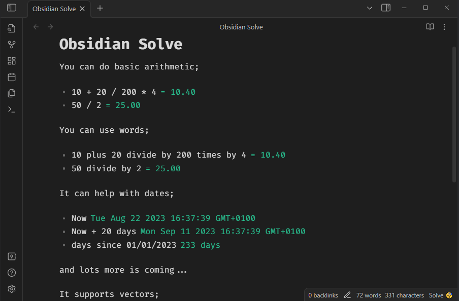

<div align="center">


**A calculator built into your notes.**

Type an expression on any line and the answer appears next to it as you
type — dates, units, percentages, currency and plain arithmetic, all in the
same note you're already writing in.

[](https://github.com/LiamRiddell/obsidian-solve/releases)
[](LICENSE.md)

[Syntax reference](https://liamriddell.github.io/solve-engine/syntax/cheatsheet/) &nbsp;•&nbsp;
[solve-engine](https://github.com/LiamRiddell/solve-engine)

</div>

<p align="center">
  
</p>

Solve is powered by [`solve-engine`](https://github.com/LiamRiddell/solve-engine),
a standalone natural-language expression engine — this plugin is the editor
integration: inline results, per-line caching, and Obsidian settings on top
of it.

```solve
10 + 20 / 200 * 4              // = 10.40
days since 01/01/2023          // = 233 days
01/01/2023 + 20 days           // = Sat Jan 21 2023
15% of 2400                    // = 360
100cm + 2m                     // = 300.00 cm
$100 + $250                    // = $350.00
```

The [syntax reference](https://liamriddell.github.io/solve-engine/syntax/cheatsheet/)
is the full list of what the engine understands — arithmetic, dates,
percentages, units, currency, dice, conditionals, and more. Everything on
that page works the same way inside a note.

## Install

**From Obsidian (recommended)**

- Open Settings → Community plugins → Browse
- Search for "Solve"
- Click Install, then Enable

**Manually**

- Copy `main.js`, `styles.css`, and `manifest.json` into
  `VaultFolder/.obsidian/plugins/solve/`
- Reload Obsidian and enable the plugin from Community plugins

## How it works

Each line is evaluated independently as you type. A result that resolves
immediately (arithmetic, dates, units) renders inline right away; a result
that depends on an async source (currency conversion, live weather) shows a
pending state until it resolves. Click a result to commit it into the line
as text.

Evaluation, caching, and formatting all come from `solve-engine` — this
repository only wires that engine into Obsidian's editor (CodeMirror 6) and
exposes the parts of it that make sense as user-facing settings (safety
limits, result formatting, inline-solve commit behaviour). See
[solve-engine](https://github.com/LiamRiddell/solve-engine) for the engine
itself, including its architecture and design notes.

## Credits

- [solve-engine](https://github.com/LiamRiddell/solve-engine) — the
  expression engine this plugin embeds.
- [Obsidian](https://obsidian.md/) — the platform this plugin is built for.
- [convert](https://github.com/convert-units/convert-units) — unit
  conversion tables used by the engine's units package.

## License

MIT. See [LICENSE.md](LICENSE.md).

If it's useful to you, [sponsorship](https://github.com/sponsors/LiamRiddell)
or a [coffee](https://www.buymeacoffee.com/liamriddell) is welcome and never
expected.
